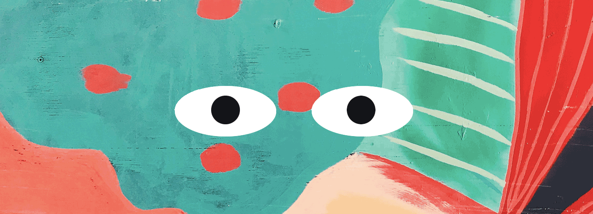

# Eye Movement Exercise

Watch the eyes follow the cursor around the browser window! This assigned exercise from Week 8 of MIT's Professional Certificate in Coding helped pull together some of the concepts we had learned in CSS, Javascript and HTML. The code makes use of an "on mouse move" event and the eyes are simple CSS shapes. I added a background image from Unsplash to liven it up a bit (photo by [S O C I A L . C U T](https://unsplash.com/@socialcut?utm_source=unsplash&utm_medium=referral&utm_content=creditCopyText))

## Installation

Upon cloning the files (eyes.js, styles.css, background image jpeg and index.html) launch the HTML file in the browser of your choice. You'll be able to see the eyes following your mouse as you move it around the browser window. 

## Future Improvements

I have a few ideas for how to build on this exercise, including having it swap out fun background images (maybe a puppy eyes generator??) or having it "blink" on click. 
